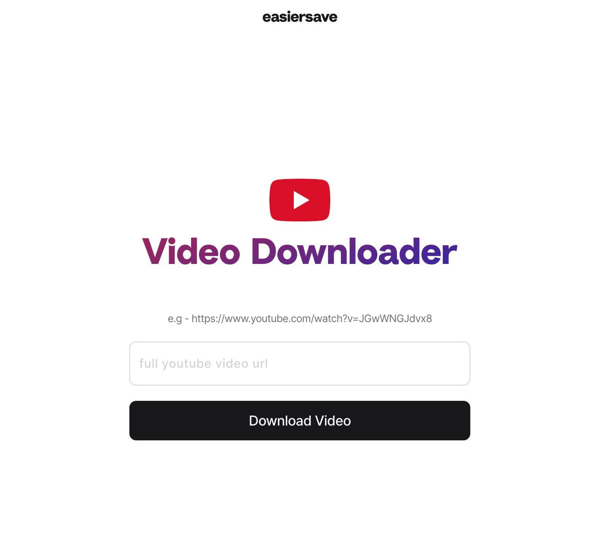

# EASIERSAVE | Youtube Video Downloader



- **Framework**: [Next.js](https://nextjs.org/)
- **Deployment**: [Vercel](https://vercel.com)
- **Styling**: [Twin.macro/Tailwind CSS](https://github.com/ben-rogerson/twin.macro)

## Running Locally

```bash
git clone https://github.com/cs50victor/easiersave.git
cd easiersave
yarn
yarn dev
```

[](https://vercel.com/new/git/external?repository-url=https%3A%2F%2Fgithub.com%2Fcs50victor%2Feasiersave)
